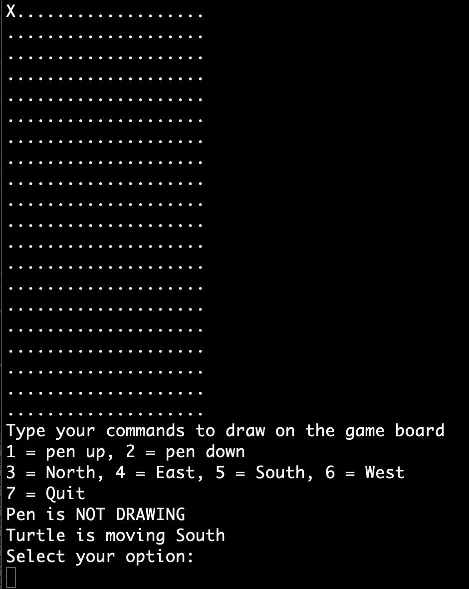
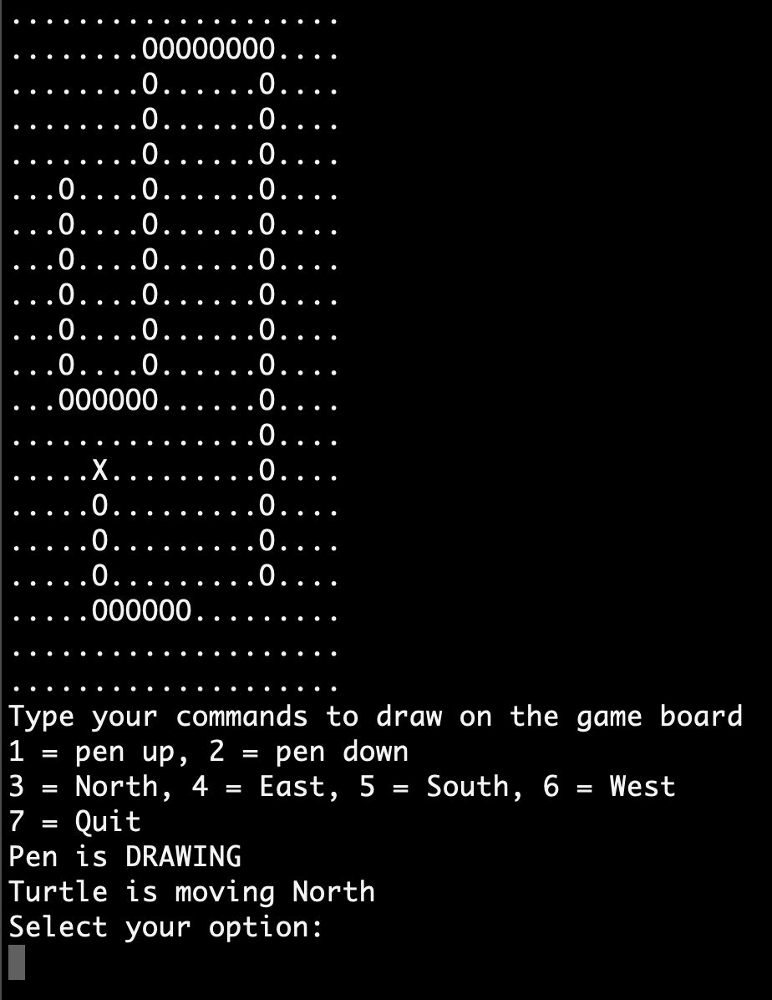

# Turtle Graphics

## Instructions
This is a drawing game for the Console, built in order to practice C# in .NET.

Open the program in Visual Studio and click play.

There are seven commands to play the game. You are instructed to select an option and the number of steps to move. If the pen is down you will draw and if the pen is up the marker will only move.

1 = pen up
2 = pen down (in order to draw)

3 = North
4 = East
5 = South
6 = West

7 = Quit

## Screenshots
Start

Example drawing

## Built with
The project is built in Visual Studio for Mac, as a .NET Console Project, with C# as programming language

## Author
* Albert Stjärne (https://github.com/AlbertStjarne)